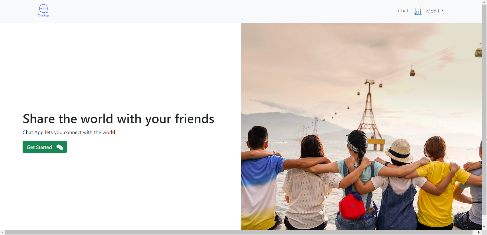
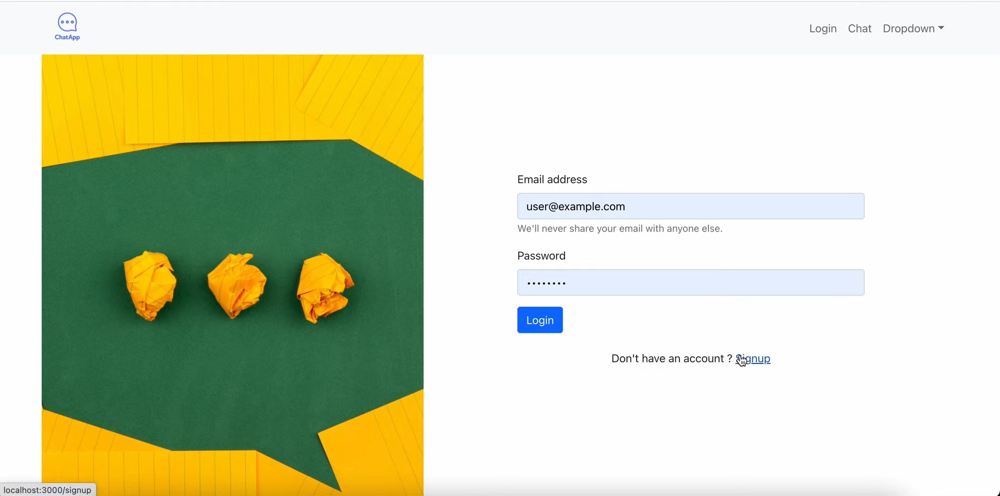
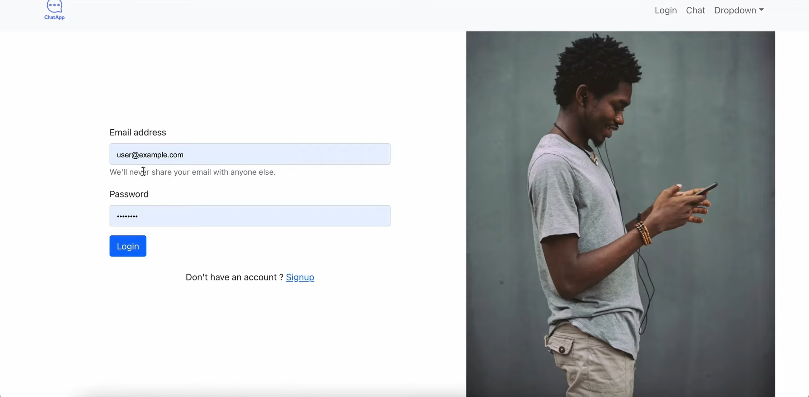

# Chat App
## Setup
For starting the app in your local server first install the dependencies using ```npm install``` in both frontend and backend folders

## Features
Personal messaging  
Crating different groups  
Creating you own profile with prfile picture  

## Screenshots
  
  
  
  
  
