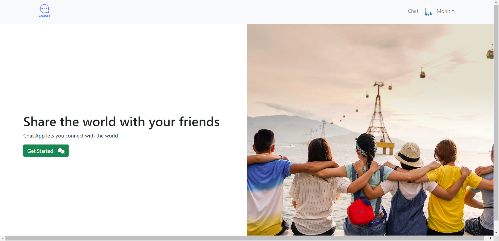
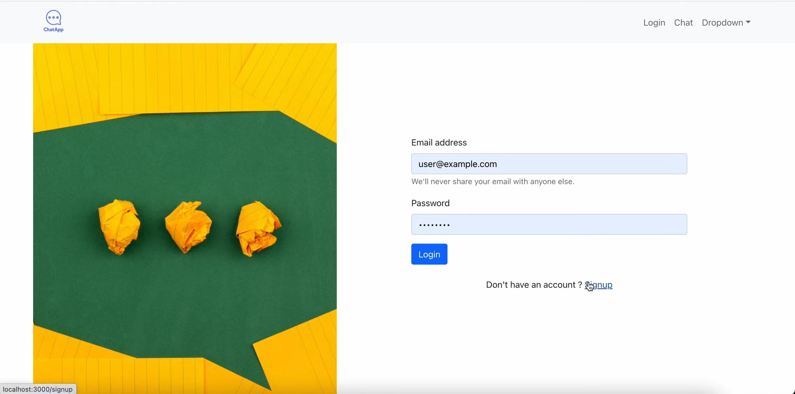
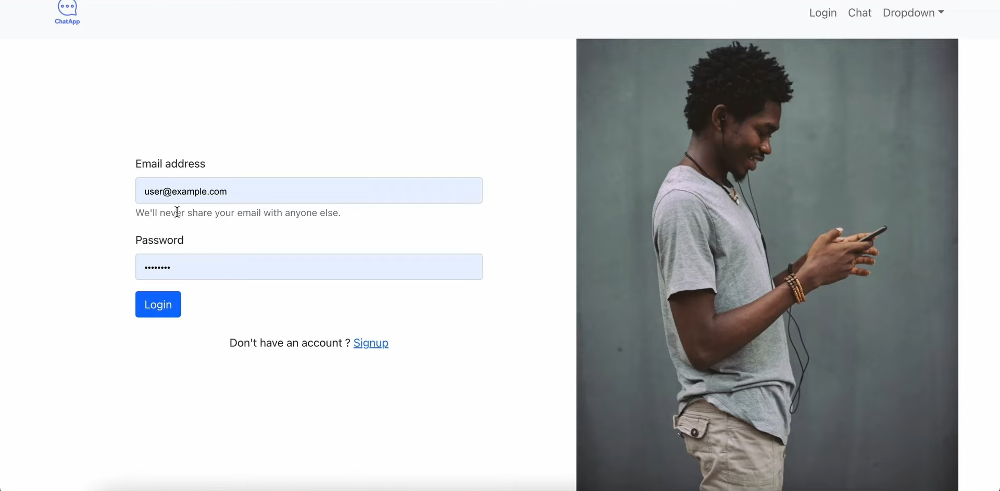

# Chat App
## Setup
For starting the app in your local server first install the dependencies using ```npm install``` in both frontend and backend folders
## App pages
  
  
  
## Features
Personal messaging  
Creating different groups  
Creating your own profile with profile picture  
